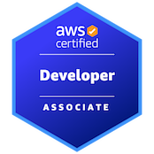

# Resume
## **Summary**
Software engineer with 2 years of experience in automation engineering and 1 year of experience as a software developer. Skilled in designing, developing, and implementing software solutions. Seeking to work with a company to apply my technical skills and contribute to the development of robust and innovative software solutions.

---
## **Work Experience**
<b/n> Automation Engineer </b> 
New Classrooms | New York, New York </b> 
September 2021 - April 2023 </b> 

* Designed and developed a suite of automated tests for the Scheduler Pilot system using Python, REST API, Graphql, Pytest.
* Implemented and developed the logic of a Notification system to facilitate the monitoring of missing schedules for other team members using Python, REST API, PostgreSQL.
* Automated front-end tests for Roadmaps system in Python using Playwright.
* Collaborated with cross-functional teams to analyze requirements, design test cases, and execute test plans.
* Identified and reported software defects, and worked closely with developers to resolve issues.
* Actively participated in code reviews and provided feedback on testability and quality aspects of software designs.

<b/n> Software Developer Intern </b> 
MobPoll-FNA Tech, LLC | New York, New York </b> 
October 2020 - September 2021 </b> 

* Assisted in migration of the existing system from Meteor to Angular framework.
* Implemented and developed an API to store media assets into AWS S3 bucket using Python, Flask.
* Designed and developed front-end tests using Python, Selenium Web Driver.
---
## **Technical Skills**
* Programming Languages: Python
* Web Development: HTML, CSS, JavaScript
* Test Automation: Pytest, Selenium, Playwright
* Databases: PostgreSQL, SQL
* Frameworks: Django, Angular, REST API, Flask
* Version Control: Git
* Cloud frameworks: Docker, AWS Certified Associate Developer :fontawesome-brands-aws:{ .aws }
---
## **Education**
<b/n> Master of Art in computer science. </b>Brooklyn College, New York. 2017-2020  
<b/n> Bachelor of Science in Information Communication and Technology. </b >Caspian College, Iran. 2011-2013 
<b/n> Associate of Science in Electrical Engineering. </b >Daneshestan College, Iran. 2009-2011 

---
## **Certificate**

## AWS Certified Associate Developer :fontawesome-brands-aws:{ .aws }

